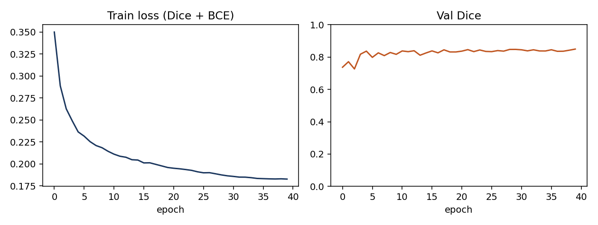
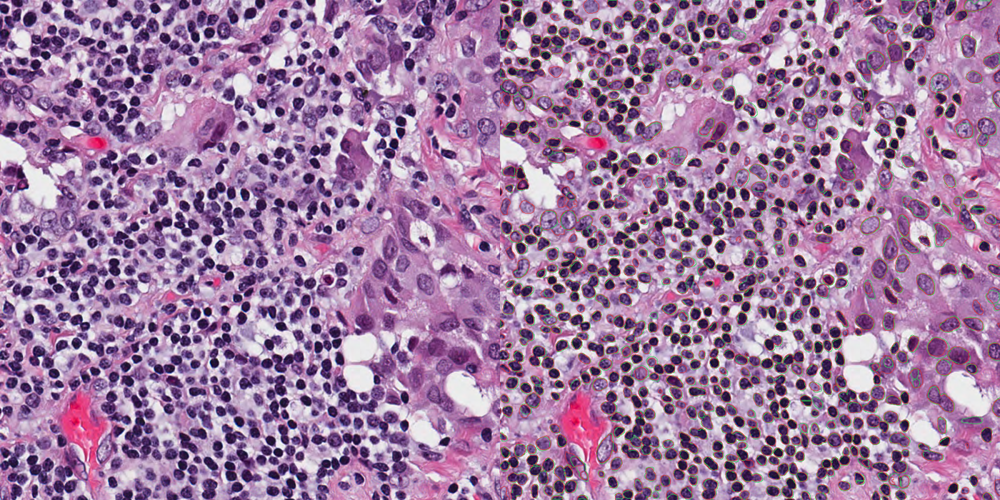
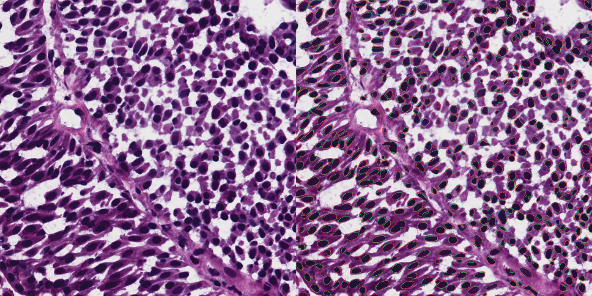
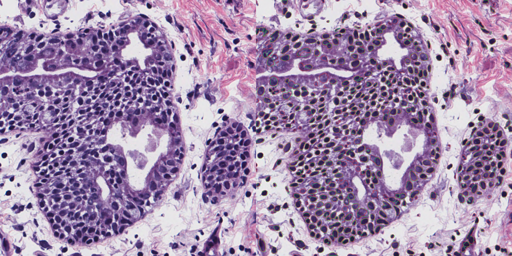

# PathoQuant

Gigapixel-aware **nuclei segmentation and quantification** for digital pathology.

A 256×256 residual U-Net never loads a 50,000×50,000 WSI. Overlap tiles → predict → Gaussian stitch → instance count / density. Built for the AIRA-style constraint: high-resolution H&E, segmentation + quantification, constant GPU memory.

## Pipeline

```
MoNuSeg 1000×1000 tiles (or a 50k WSI)
        │
        ▼
 overlap 256 tiles (stride 128)
        │
        ▼
 residual U-Net  (Dice + BCE)
        │
        ▼
 Gaussian blend  →  binary mask
        │
        ▼
 connected components  →  AJI, nuclei count, area, density / mm²
```

Classical baseline on the same tiles: Otsu → distance transform → watershed (shows where DL is required: touching nuclei).

## Dataset

[MoNuSeg](https://monuseg.grand-challenge.org/) via Hugging Face [`RationAI/MoNuSeg`](https://huggingface.co/datasets/RationAI/MoNuSeg): 37 train + 14 test H&E tiles, instance contours (~22k nuclei, 7 organs). Patient-level 80/20 split of train (30 / 7 patients, 1470 / 343 patches of 256 with stride 128). Official 14-tile test is the reported number.

## Results (measured)

Trained 40 epochs on RTX 3050 4 GB (AMP, batch 2 × accum 2, Dice + BCE, cosine LR). Best val Dice **0.849** at epoch 40.

| Split | Dice | AJI | Watershed AJI |
|---|---|---|---|
| val (patch) | 0.849 | — | — |
| **test (14 tiles)** | **0.794** | **0.521** | 0.318 |

AJI (Kumar et al., IEEE TMI) penalizes merged/split nuclei. Semantic U-Net + connected components is an honest instance readout, not HoVer-Net. DL AJI is **+0.20** over Otsu + watershed on the same tiles.



Green = GT contour, red = prediction. Left: H&E. Right: overlay.

**TCGA-44-2665** — test Dice 0.867



**TCGA-ZF-A9R5** — test AJI 0.636



**TCGA-EJ-A46H** — test Dice 0.830 / AJI 0.623



## Setup (Windows, RTX 3050)

```powershell
cd PathoQuant
python -m venv .venv
.\.venv\Scripts\Activate.ps1
pip install -r requirements.txt
pip install -e .
```

CUDA PyTorch (if not already):

```powershell
pip install torch torchvision --index-url https://download.pytorch.org/whl/cu124
```

## Run

```powershell
# 1. Download MoNuSeg and write PNG + instance maps
python -m pathoquant.prepare --out data/processed

# 2. Train U-Net (Dice + BCE, AMP, cosine LR)
python -m pathoquant.train --data data/processed --epochs 40 --batch-size 2 --out outputs

# 3. Test-split Dice / AJI + overlay figures
python -m pathoquant.evaluate --data data/processed --ckpt outputs/unet_monuseg.pt --split test

# 4. Tiled inference on any H&E (VRAM stays ~1–2 GB)
python -m pathoquant.infer --image path\to\slide_or_tile.png --ckpt outputs/unet_monuseg.pt
```

Outputs:

- `outputs/unet_monuseg.pt` — best val-Dice checkpoint  
- `outputs/training_curves.png`  
- `outputs/metrics.json` — the honest test number  
- `outputs/overlays/*.png` — H&E | GT-green / pred-red contours  

## Layout

```
src/pathoquant/
  prepare.py     Hugging Face MoNuSeg → image + instance .npy
  dataset.py     overlapping patches + H&E jitter
  model.py       residual U-Net
  losses.py      Dice + BCE
  metrics.py     Dice, Aggregated Jaccard Index
  tiling.py      50k-safe overlap tile + Gaussian stitch
  classical.py   Otsu + watershed
  quantify.py    count / mean area / density
  train.py
  evaluate.py
  infer.py
```

## Cite

Kumar et al., “A Dataset and a Technique for Generalized Nuclear Segmentation,” IEEE TMI, 2017.  
Kumar et al., “A Multi-organ Nucleus Segmentation Challenge,” IEEE TMI, 2020.
